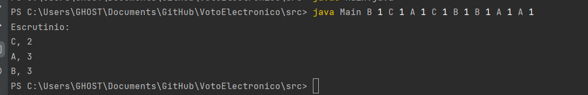
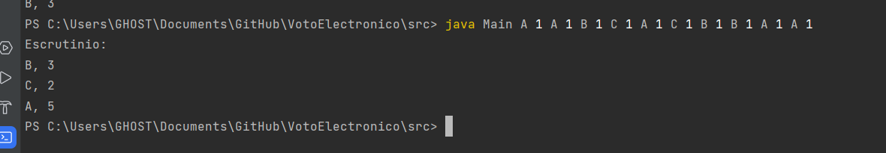
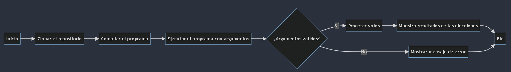

# Sistema de Votación Electrónica

Este es un programa simple en Java que simula un sistema de votación electrónica. Permite a los usuarios emitir votos para candidatos y calcular los resultados de las elecciones.

## SDK
Corretto 19:

## Inicio

1. Compila el programa:

       javac Main.java
2. Ejecuta el programa y pasa los nombres de candidatos y los IDs de votantes como argumentos de línea de comandos:
       
         java Main CandidatoA 1 CandidatoB 2 CandidatoA 3
## Uso

Ejecuta el programa utilizando el comando `java`, seguido por la clase `Main` y los pares de candidato-votante. Para cada candidato, proporciona el nombre del candidato seguido del ID del votante.

**Ejemplo:**

    java Main B 1 C 1 A 1 C 1 B 1 B 1 A 1 A 1

## Resultados

El programa mostrará los resultados de las elecciones después de procesar los votos proporcionados. La salida se verá así:

## EJECUCION EXTRA

## Diagrama

codigo mermaid

        flowchart LR
        A[Inicio] --> B[Clonar el repositorio]
        B --> C[Compilar el programa]
        C --> D[Ejecutar el programa con argumentos]
        D --> E{¿Argumentos válidos?}
        E -->|Sí| F[Procesar votos]
        E -->|No| G[Mostrar mensaje de error]
        F --> H[Muestra resultados de las elecciones]
        H --> I[Fin]
        G --> I[Fin]

CARLOS G.